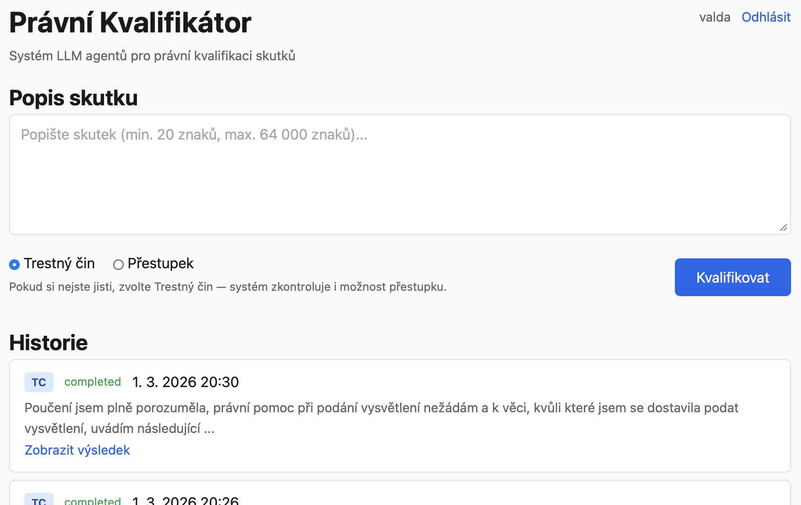
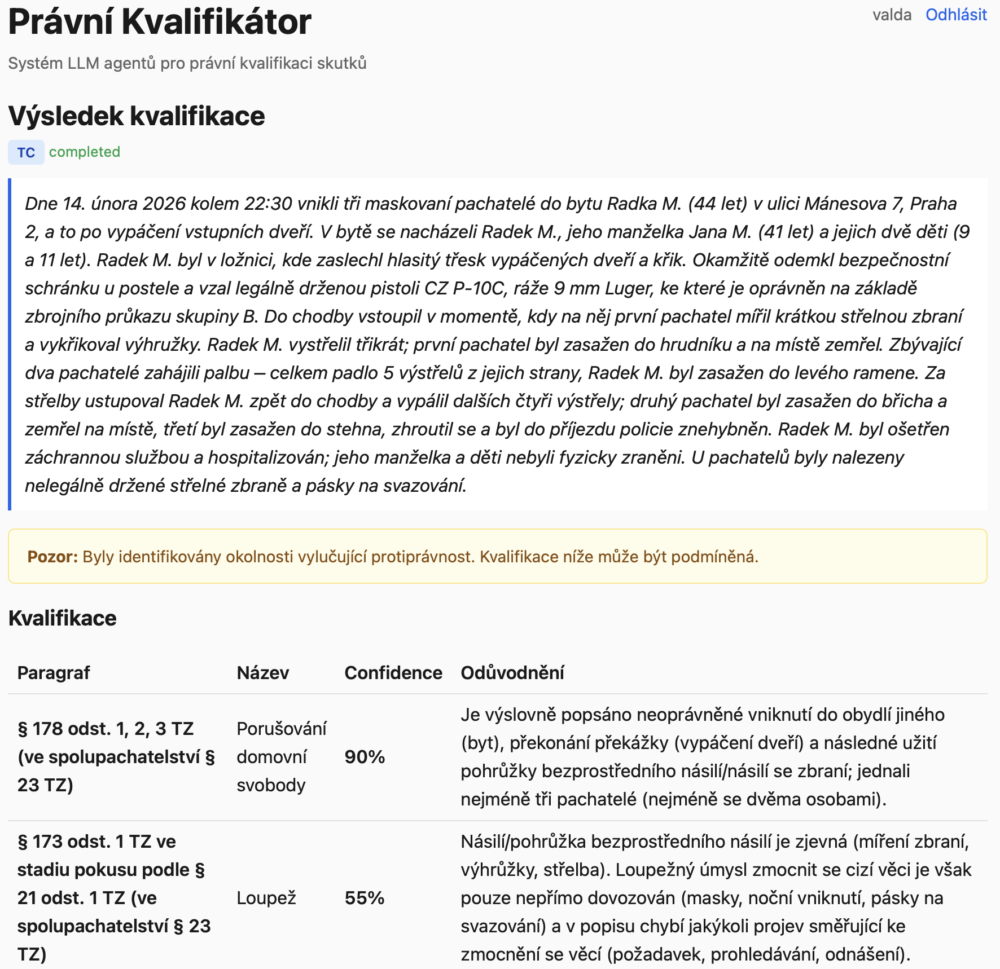
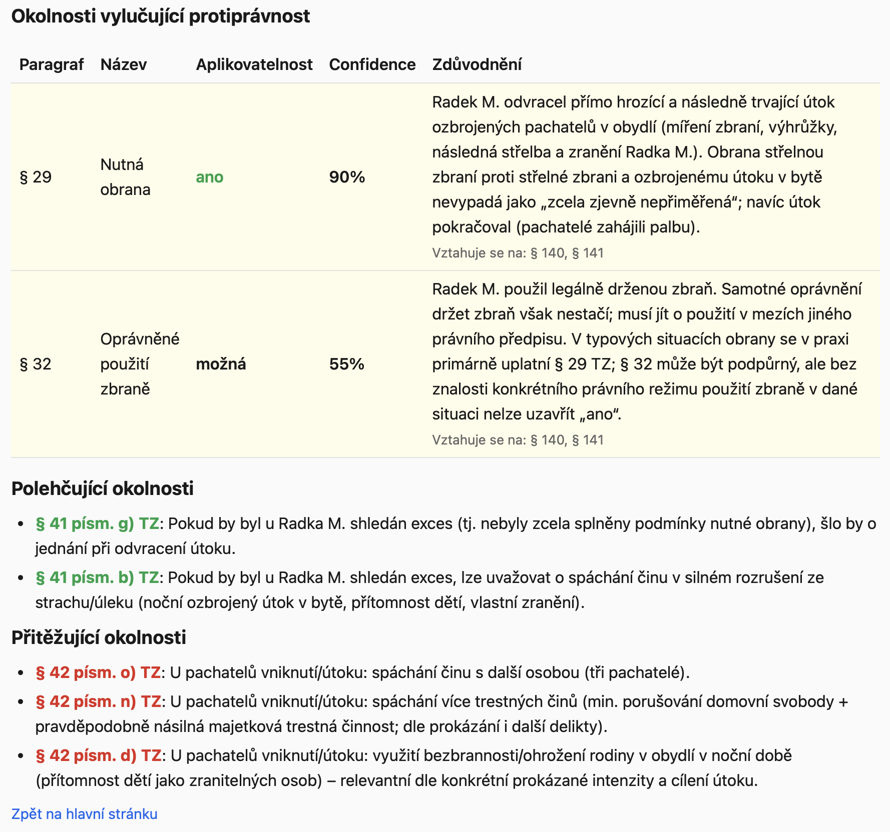

# Právní Kvalifikátor

Systém LLM agentů pro právní kvalifikaci skutků podle českého trestního práva.

Zadejte textový popis skutku — systém automaticky určí, o jaké trestné činy nebo přestupky se jedná, přiřadí konkrétní paragrafy s odůvodněním a skóre spolehlivosti, posoudí okolnosti vylučující protiprávnost (krajní nouze, nutná obrana aj.) a identifikuje přitěžující okolnosti.

## Co aplikace umí

**Vstup:** volný text popisující skutek (typicky z policejního protokolu, trestního oznámení nebo výpovědi svědka), volba typu deliktu (trestný čin / přestupek).

**Výstup:**
- **Právní kvalifikace** — konkrétní paragrafy TZ/přestupkového zákona s názvem, odstavcem a písmenem, včetně skóre spolehlivosti a podrobného odůvodnění
- **Okolnosti vylučující protiprávnost** — automatická kontrola krajní nouze, nutné obrany, svolení poškozeného, přípustného rizika aj. s posouzením aplikovatelnosti
- **Přitěžující okolnosti** — identifikace relevantních přitěžujících okolností dle § 42 TZ
- **Kontrola zvláštních zákonů** — agent prověří i předpisy mimo trestní zákoník (zbraně, drogy, silniční provoz aj.)

Pod kapotou pracuje pipeline 6 specializovaných LLM agentů, kteří společně analyzují popis skutku, prohledávají databázi zákonů pomocí vektorového vyhledávání a výslednou kvalifikaci vzájemně revidují.

<p align="center">
  
  <br>
  <em>Zadání popisu skutku s volbou typu deliktu a historie předchozích kvalifikací</em>
</p>

<p align="center">
  
  <br>
  <em>Výsledek kvalifikace — konkrétní paragrafy TZ s odůvodněním a skóre spolehlivosti</em>
</p>

<p align="center">
  
  <br>
  <em>Posouzení okolností vylučujících protiprávnost, polehčujících a přitěžujících okolností</em>
</p>

## Požadavky

- Python 3.12+
- [uv](https://docs.astral.sh/uv/) (package manager)
- Azure OpenAI API přístup (GPT-5.2 + text-embedding-3-large)

## Instalace

```bash
# Klonování repozitáře
git clone <repo-url>
cd pravni-kvalifikator

# Instalace závislostí
uv sync --group dev

# Konfigurace
cp .env.example .env
# Vyplňte AZURE_OPENAI_ENDPOINT a AZURE_OPENAI_API_KEY
```

## Příprava dat

Tři kroky, **v tomto pořadí** (krok 2 generuje popisy hlav, které krok 3 použije pro embeddingy):

```bash
# 1. Stažení a parsování zákonů z zakonyprolidi.cz
uv run python scripts/load_laws.py

# 2. Generování LLM metadat — popisy hlav + strukturovaná metadata paragrafů (vyžaduje Azure OpenAI)
uv run python scripts/generate_metadata.py

# 3. Generování embeddingů (vyžaduje Azure OpenAI)
uv run python scripts/generate_embeddings.py
```

## Spuštění

```bash
# Spustit MCP server (v jednom terminálu)
uv run uvicorn pravni_kvalifikator.mcp.server:app --port 8001

# Spustit web aplikaci (v druhém terminálu)
uv run pq-web
```

Otevřete http://localhost:8000 v prohlížeči.

## Architektura

```
Web Browser → FastAPI (:8000) → LangGraph Agents → MCP Server (:8001) → SQLite + sqlite-vec
```

- **MCP Server**: FastMCP s 9 nástroji pro přístup k databázi zákonů
- **Agent Pipeline**: 6 LangGraph agentů (identifikace → klasifikace → selekce → kvalifikace → kontrola speciálních zákonů → review)
- **Web App**: FastAPI + Jinja2 + SSE streaming průběhu

## Autentizace

Přístup do webového rozhraní je chráněn HMAC tokenem. Autentizace se zapíná nastavením `AUTH_HMAC_KEY` v `.env` (prázdná hodnota = auth vypnutá).

### Vygenerování tokenu

```bash
uv run pq-token --username <jmeno> --valid-until <YYYYMMDD>
```

Příklad — token pro uživatele `jan` platný do konce roku 2027:

```bash
uv run pq-token --username jan --valid-until 20271231
# Výstup: Token: jan:20271231:a1b2c3d4...
```

### Přihlášení

1. Otevřete http://localhost:8000 → automatický redirect na `/login`
2. Vložte vygenerovaný token do formuláře
3. Po ověření se token uloží jako HTTP-only cookie

### Formát tokenu

```
USERNAME:YYYYMMDD:HMAC_SHA256_HEX
```

- **USERNAME** — alfanumerické znaky, tečky, pomlčky, podtržítka (max 64 znaků)
- **YYYYMMDD** — datum platnosti (včetně, tzn. token je platný celý tento den)
- **HMAC_SHA256_HEX** — kryptografický podpis (`HMAC-SHA256(AUTH_HMAC_KEY, "USERNAME:YYYYMMDD")`)

## Testy

```bash
uv run pytest tests/ -v
```

## Licence

Apache 2.0
